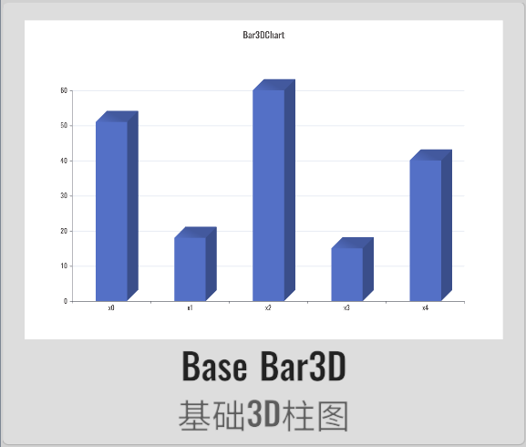
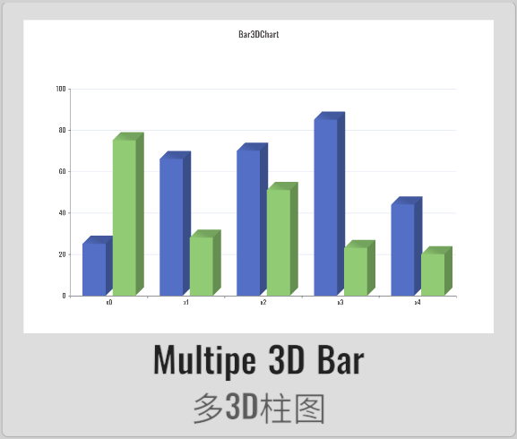
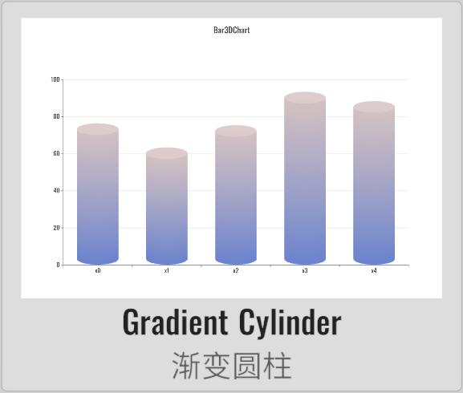
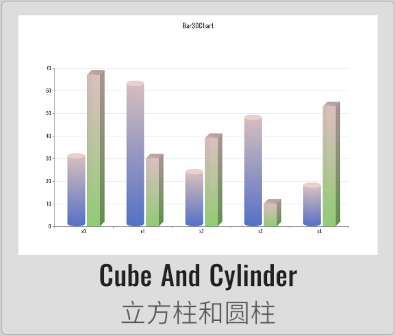

# Bar3DChart 3D柱图

XCharts的付费扩展图表 - 3D柱图。

## 截图

<table>
    <tr>
        <td></td>
        <td></td>
        <td></td>
        <td></td>
    </tr>
    <tr>
        <td></td>
        <td></td>
        <td></td>
        <td></td>
    </tr>
    <tr>
        <td></td>
        <td></td>
    </tr>
</table>

## 许可

扩展图表，需付费购买后才获得使用许可。

## 示例

Demo仓库：[XCharts-Bar3DChart-Demo](https://github.com/XCharts-Team/XCharts-Bar3DChart-Demo)

## 教程

[扩展图表如何导入Demo项目或导入自己项目](https://github.com/XCharts-Team/XCharts-Demo)

## 文档

[API](Documentation~/zh/api.md)  
[配置项手册](Documentation~/zh/configuration.md)  
