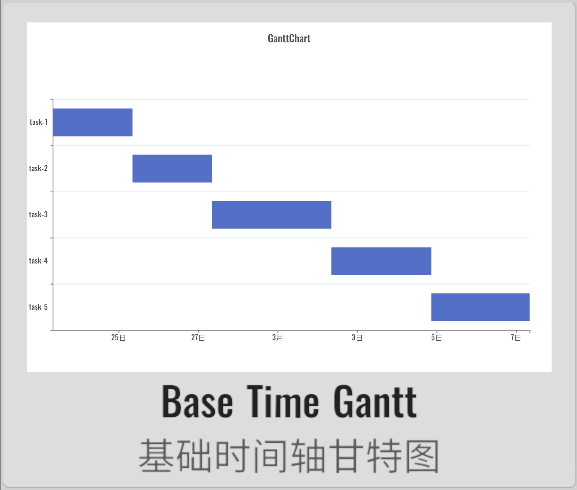

# GanttChart

XCharts paid extension chart - Gantt Chart.

## Screenshots

<table>
    <tr>
        <td></td>
        <td></td>
        <td></td>
        <td></td>
    </tr>
    <tr>
        <td></td>
        <td></td>
        <td></td>
    </tr>
</table>

## License

Extension charts require a paid purchase to obtain a usage license.

## Example

Demo repository: [XCharts-GanttChart-Demo](https://github.com/XCharts-Team/XCharts-GanttChart-Demo) 

## Tutorial

[How to import extension charts into a demo project or your own project](https://github.com/XCharts-Team/XCharts-Demo) 

## Documentation

[API](Documentation~/en/api.md)  
[Configuration Manual](Documentation~/en/configuration.md)
