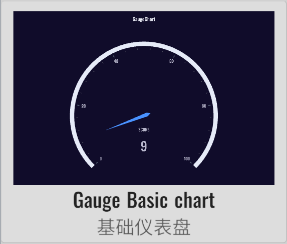
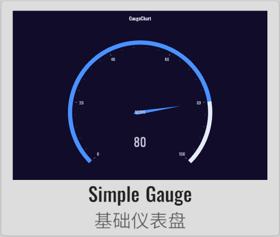
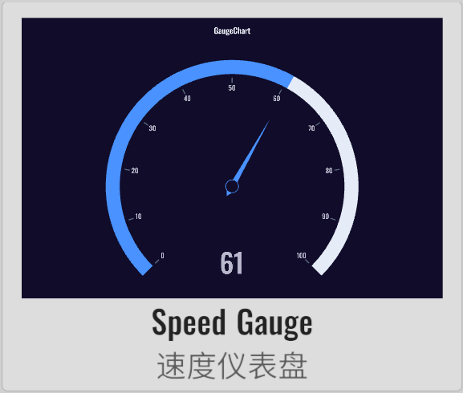
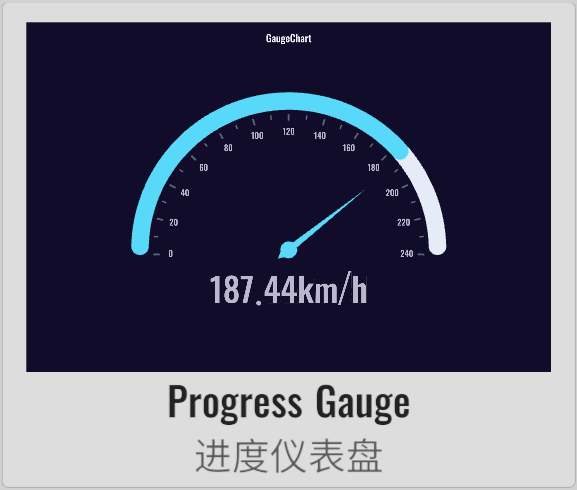
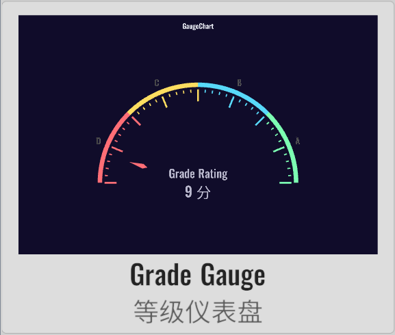
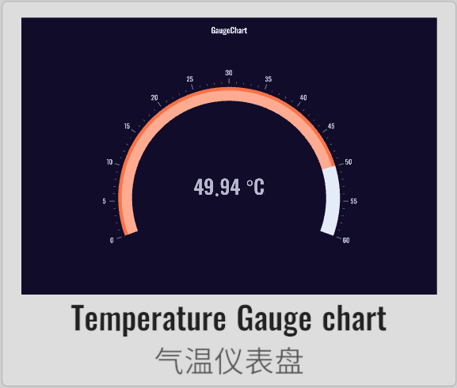
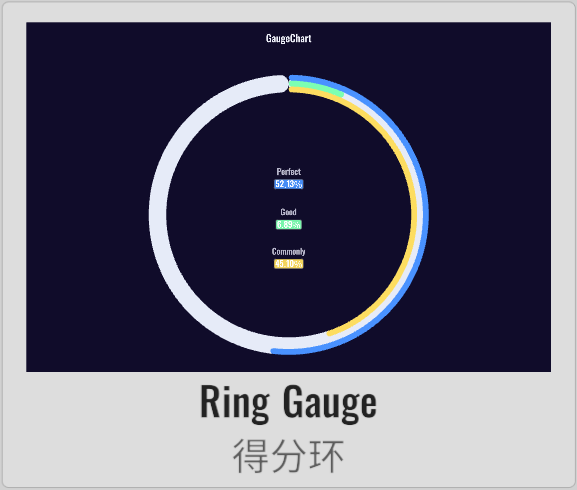
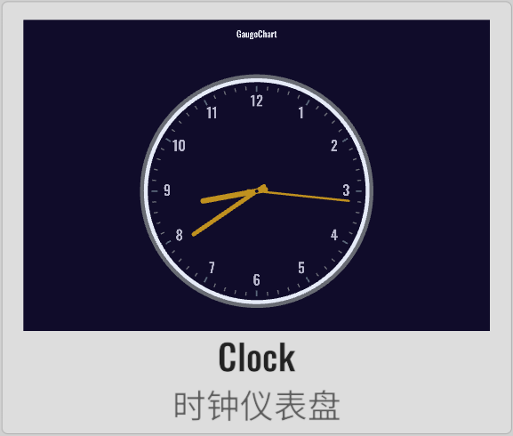
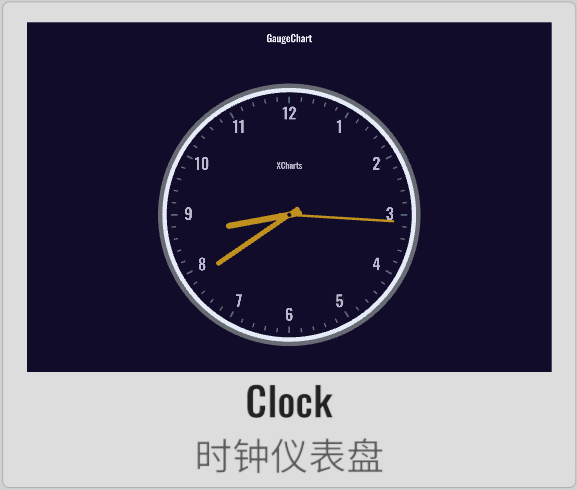
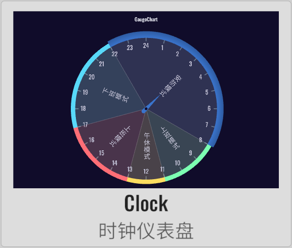

# GaugeChart 仪表盘

XCharts付费扩展图表 - 仪表盘。

## 截图

||||||
| :--: | :--: | :--: | :--: | :--: |
| | | | | | |
| | | | | |
| | | |

## 许可

扩展图表，需付费购买后才获得使用许可。

## 教程

[扩展图表如何导入Demo项目或导入自己项目](https://github.com/XCharts-Team/XCharts-Demo)

## 文档

[API](Documentation~/zh/api.md)  
[配置项手册](Documentation~/zh/configuration.md)  

## 日志

### v3.9.0

* (2023.12.01) 发布`v3.9.0`版本
* (2023.12.01) 更新文档

### v3.8.0

* (2023.07.31) 同步`XCharts v3.8.0`

### v3.6.1

* (2023.06.08) 发布`v3.6.1`版本
* (2023.06.08) 更新文档

### v3.6.0

* (2023.04.01) 发布`v3.6.0`版本
* (2023.03.17) 增加`Gauge`的`rangeDataMode`可设置是否使用范围数据模式
* (2023.03.17) 增加`Gauge`的`loop`可设置是否循环数据，用于时钟甘特图
* (2023.03.17) 增加`GaugePointer`的`value`可设置指针位置
* (2023.03.17) 增加`Clock`时钟仪表盘支持
* (2023.03.13) 增加`GaugePointer`的`nowTime`可设置指针指向当前时间
* (2023.03.13) 增加`GaugePointer`的`value`可设置当前指针位置
* (2023.03.13) 增加`Clock`类型的甘特图支持
* (2023.02.14) 同步`XCharts v3.6.0`

### v3.5.0

* (2022.12.01) 发布`v3.5.0`版本
* (2022.11.27) 调整`Documentation`文档结构

### v3.4.0

* (2022.10.05) 增加`GaugeAxisLine`的`stageGradient`支持设置阶段渐变色过渡

### v3.3.0

* (2022.09.28) 发布`v3.3.0`版本
* (2022.08.26) 修复`Pointer`在普通模式下不显示的问题
* (2022.08.25) 增加`label`颜色跟随数值变化的支持

### v3.2.0

* (2022.08.22) 发布`v3.2.0`版本
* (2022.08.19) 同步`XCharts v3.2.0`
* (2022.08.15) 支持渐变
