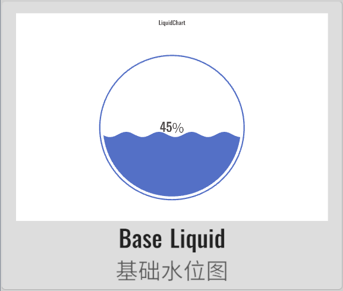
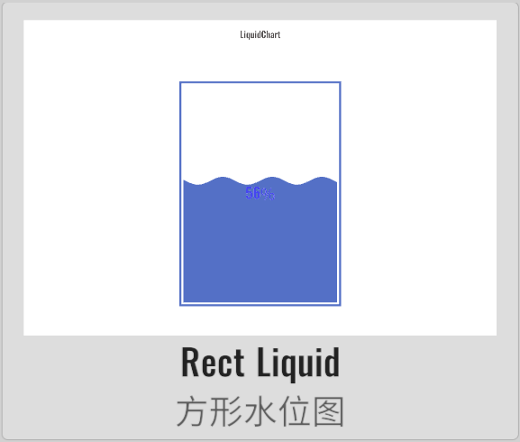
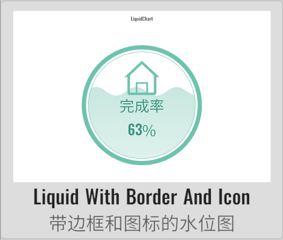
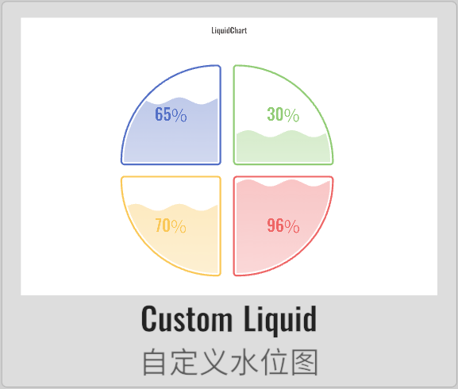

# LiquidChart 水位图

XCharts的付费扩展图表 - 水位图。

## 截图

||||||
| :--: | :--: | :--: | :--: | :--: |
| | | | | | |
| | |

## 许可

扩展图表，需付费购买后才获得使用许可。

## 示例

Demo仓库：[XCharts-LiquidChart-Demo](https://github.com/XCharts-Team/XCharts-LiquidChart-Demo)

## 教程

[扩展图表如何导入Demo项目或导入自己项目](https://github.com/XCharts-Team/XCharts-Demo)

## 文档

[API](Documentation~/zh/api.md)  
[配置项手册](Documentation~/zh/configuration.md)  

## 日志

### v3.10.0

* (2024.01.21) 增加`Liquid`的更多创建默认图表的快捷方式和API

### v3.9.0

* (2023.12.01) 发布`v3.9.0`版本
* (2023.12.01) 更新文档

### v3.8.0

* (2023.07.31) 同步`XCharts v3.8.0`

### v3.6.1

* (2023.06.08) 发布`v3.6.1`版本
* (2023.06.08) 更新文档

### v3.6.0

* (2023.04.01) 发布`v3.6.0`版本
* (2023.02.14) 同步`XCharts v3.6.0`

### v3.5.0

* (2022.12.01) 发布`v3.5.0`版本
* (2022.11.27) 调整`Documentation`文档结构

### v3.4.0

* (2022.11.01) 支持`Animation`的`unscaledTime`
* (2022.11.01) 同步`XCharts v3.4.0`

### v3.2.0

* (2022.08.22) 发布`v3.2.0`版本
* (2022.08.19) 同步`XCharts v3.2.0`
