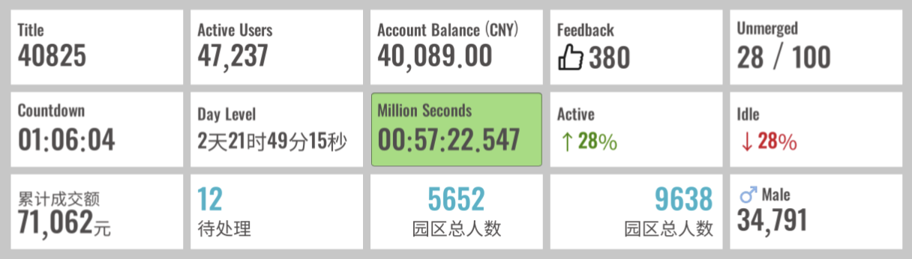

# UIStatistic

The "Statistical Value" component. Used to display statistical values.

When to use:

* When you need to highlight a single number or a set of numbers.
* When you need to display statistical data with descriptions.

Supported features include:

* Regular numbers
* Countdown timers
* Adding icons
* Changing animations
* Event callbacks
