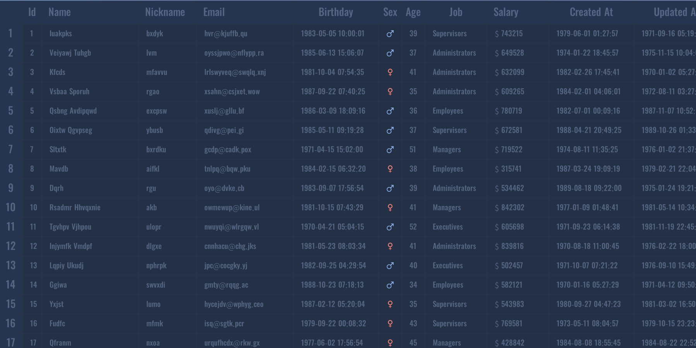

# UITable

The "Table" component. Can be used to display row and column data.

Supported features include:

* Show or hide the list header
* Show or hide the row header
* Adjust the width and height of rows and columns as needed
* Support for row numbers
* Support for selection
* Support for divider lines
* Support for scrolling and dragging
* Support for scroll bars
* Support for icons and images
* Support for carousel
* <del>Sorting (temporarily not supported)</del>
* <del>Pagination (temporarily not supported)</del>
* <del>Searching (temporarily not supported)</del>
* <del>Filtering (temporarily not supported)</del>