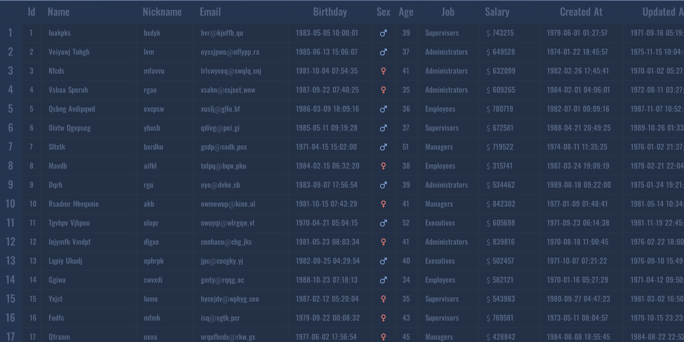

# UITable 表格

`表格`组件。可用于展示行列数据。

支持的功能有：

* 显示或隐藏列表头
* 显示或隐藏行表头
* 任意调整行列宽高
* 支持行号
* 支持选中
* 支持分割线
* 支持滚动和拖拽
* 支持滚动条
* 支持图标图片
* 支持轮播
* <del>排序（暂不支持）</del>
* <del>分页（暂不支持）</del>
* <del>查找（暂不支持）</del>
* <del>过滤（暂不支持）</del>